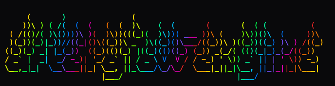

# afterglow-engine


*A small offline tool that mines your past audio work for new textures.*

---

## What this is(n't) — a metaphor

*Imagine this:*

*In a back room of your studio, you’ve secretly built a machine.*

*It doesn’t paint.*  
*It doesn’t choose subjects.*  
*It never tells you what to do with the canvas.*

*All it does is this:*

*You slide in your old work—finished canvases, abandoned panels, primed boards with ghosts of sketches under the gesso, photos of murals that no longer exist, even quick studies on cheap paper you once did just to get your hand moving.*

*Inside, the machine:*

* *very carefully **unweaves** each piece,*
* *separates pigment from gesture,*
* *peels off glazes from underpainting,*
* *collects tiny flakes of colour from places no one ever really looked at.*

*It doesn’t keep compositions.*  
*It doesn’t remember figures or horizons.*

*It just saves **texture and colour**:*

* *a particular bruised green that only ever happened once when two paints misbehaved together,*
* *the way a translucent violet settled into the tooth of the canvas,*
* *that dry, scratchy ochre from a brush you forgot to clean,*
* *the chalky margin where gesso met raw linen.*

*Then it grinds those fragments down and re-bottles them into small, unlabelled jars:*

* *“evening wall light,”*
* *“wet concrete after a storm,”*
* *“skin in winter,”*
* *“dust on a forgotten windowsill.”*

*On your main table, nothing has changed:*  
*It’s still you, blank surface, brushes, knives, rags.*

*The only difference is your palette.*

*Now, when you reach for colour, you’re not just squeezing paint from factory tubes—you’re dipping into **distilled memories of your own work**:*

* *the atmosphere from a painting you sold years ago,*
* *the softness from a figure you painted over,*
* *the strange, accidental pink from a ruined canvas that still haunts you.*

*What we’ve built is that quiet machine:*  
*a patient studio assistant that wanders through your archives, gently steals back the colours and surfaces you’ve already invented, and lays them out again as fresh pigment.*

*So future paintings are not just new images.*  
*They’re painted with **the ground-up archaeology of everything you’ve ever touched.***

---

## The Machine

`afterglow-engine` is that idea—**sonic archaeology**—implemented in code.

It doesn’t make tracks.  
It doesn’t make creative choices.  
It doesn’t invent new sounds.

It simply walks the corridors of your archive, listening for the **afterglow** of your past work. It searches for the moments where the music stopped moving and started breathing—the stable pads, the textural grain, the dust in the air.

It isolates these moments, stabilizes them, and re-bottles them as **distilled artifacts**:

- **Pads** looped not by bars, but by phase.  
- **Clouds** formed from the grain of tonal memory.  
- **Dust** swept from the transients of forgotten drums.

It hands them back to you not as “content,” but as **pigment**.

---

## Quick Start

**New user?** Start with the [15-minute tutorial](docs/TUTORIAL.md) →

The short version:

```bash
# 1. Create and activate a virtualenv
python -m venv venv
source venv/bin/activate

# 2. Install dependencies
pip install -r requirements.txt

# 3. Preview what will be generated (no files created)
python make_textures.py --all --dry-run

# 4. Generate textures from the default folders
python make_textures.py --all
```

This will:

* create a default `config.yaml` (if it does not exist),
* read audio from the default input folders,
* write textures into `export/tr8s/<Source_Name>/{pads,swells,clouds,hiss}` as 44.1 kHz WAVs.

---

## What's New

Latest: **v0.9.0 – The Sentinel (Production Hardening)**

A production readiness release transforming afterglow-engine from prototype to battle-tested system:

**Observability & Error Handling:**
* **Structured logging** – Module-level tagging with configurable verbosity (`AFTERGLOW_LOG_LEVEL`)
* **Custom exception hierarchy** – Domain-specific errors (SilentArtifact, ClippedArtifact) with debugging context
* **Graceful degradation** – Batch processing continues when individual files fail
* See [docs/LOGGING.md](docs/LOGGING.md), [docs/ERROR_HANDLING.md](docs/ERROR_HANDLING.md)

**CI/CD & Quality Gates:**
* **GitHub Actions workflows** – Automated testing across Python 3.11
* **Performance regression detection** – Fails builds if >20% slower than baseline
* **Code quality checks** – Flake8, Black, MyPy integration
* See [docs/CI_CD.md](docs/CI_CD.md)

**Robustness:**
* **Edge case hardening** – 26 robustness tests for corrupt audio, extreme configs, filesystem issues
* **Input validation** – NaN/Inf detection, parameter range checking across all DSP functions
* **Security** – Path traversal protection with `AFTERGLOW_UNSAFE_IO` testing override

**Performance:**
* **STFT caching corrected** – >100,000× speedup on subsequent calls (essentially free after first computation)
* **Single-pass overhead** – 66% reduction in STFT overhead within analysis passes
* See [docs/PERFORMANCE.md](docs/PERFORMANCE.md)

**Migration:**
* **Minimal breaking changes** – Most v0.8 code works unchanged
* **Migration guide** – Step-by-step upgrade instructions at [docs/MIGRATION_V0.9.md](docs/MIGRATION_V0.9.md)

---

**v0.8.1 – Documentation & Tutorial**

A documentation patch adding a comprehensive 15-minute getting started guide. No functional changes from v0.8.0.

---

**v0.8.0 – Refined Clouds**

**UX Enhancements:**
* **Progress bars** – Visual feedback during long operations (tqdm)
* **Dry-run mode** – Preview generation with `--dry-run` flag
* **Config presets** – 4 optimized workflows in `examples/presets/`
  - `config_minimal.yaml` – Learning the system
  - `config_fast_sketch.yaml` – Quick iteration (~60% faster)
  - `config_dense_clouds.yaml` – Rich granular textures (600 grains)
  - `config_impossible.yaml` – Maximum extraction variety

**Performance & Validation:**
* **STFT caching** – Eliminates redundant computation in analysis
* **Performance profiling** – Benchmark suite (`tests/profile_performance.py`)
* **DSP validation** – Regression tests for spectral analysis, crossfades
* **O(n^0.83) scaling** – Sublinear cloud generation (faster than expected!)

**Quality Improvements:**
* **Equal-power crossfades** – Constant perceived loudness (√-based curves)
* **Spectral centroid fix** – Per-window averaging (tonal filtering across full file)
* **Config schema v0.8** – Bidirectional pitch ranges, stereo export control

See [CHANGELOG.md](CHANGELOG.md) for full release history or [TUTORIAL.md](docs/TUTORIAL.md) to get started.

---

## Where Everything Lives

* **Source & scripts**: code and configs live at the repo root (`musiclib/`, `make_textures.py`, `config.yaml`, `validate_config.py`).
* **Docs**: see `docs/` for quick references and workflows (e.g. `CONFIG_QUICK_REFERENCE.md`, `BATCH_WORKFLOW.md`).

### Project Structure

```text
.
├── config.yaml                   # Configuration (auto-generated on first run)
├── requirements.txt              # Python dependencies
├── README.md                     # This file
├── validate_config.py            # Config validator
├── make_textures.py              # Main CLI entrypoint
├── musiclib/                     # Python package
│   ├── __init__.py
│   ├── io_utils.py               # File discovery, loading, saving
│   ├── segment_miner.py          # Pad mining from sustained segments
│   ├── drone_maker.py            # Pad loops & swells with variants
│   ├── granular_maker.py         # Granular cloud generator
│   ├── hiss_maker.py             # Hiss loops & flicker bursts
│   └── dsp_utils.py              # Filters, envelopes, normalization, analysis
├── source_audio/                 # Drop your audio files here
├── pad_sources/                  # Hand-picked tonal material (optional)
├── drums/                        # Percussive material for hiss (optional)
└── export/
    ├── manifest.csv              # Optional manifest/curation data
    └── <Source_Name>/
        ├── pads/                 # Loopable pad outputs
        ├── swells/               # Swell one-shots
        ├── clouds/               # Granular textures
        └── hiss/                 # Hiss loops & flickers
```

---

## Testing (smoke & verification)

* **Full test suite**:
  ```bash
  pytest
  ```
  149 tests covering DSP validation, spectral analysis, crossfades, grain synthesis, batch tools, curation logic, robustness (corrupt audio, extreme configs, filesystem issues), security, and error handling.

* **CI/CD**:
  Automated testing runs on every commit via GitHub Actions across Python 3.11. See [docs/CI_CD.md](docs/CI_CD.md).

* **Determinism**:
  Set `reproducibility.random_seed` in your config to make test runs repeatable.

* **Performance profiling**:
  ```bash
  python tests/profile_performance.py
  ```
  Benchmarks STFT caching, cloud generation scaling, and pipeline bottlenecks. See [docs/PERFORMANCE.md](docs/PERFORMANCE.md).

---

## Dependencies & Notes

* **librosa** is required for pitch shifting and some analysis paths. If it's absent, those paths fail gracefully (e.g. cloud pitch-shift is skipped), but install the full `requirements.txt` for intended behavior.
* Exports are WAVs (44.1 kHz, 16/24-bit) organized by source folder.
* **Python support**: Tested and CI-validated on Python 3.11 across all commits. Earlier versions (3.8+) may work but are not regularly tested.

---

## Features

* **Pad Mining**  
  Automatically extract short, loopable pad segments from existing audio files.

* **Drone Generation**  
  Time-stretch, pitch-shift, and process audio into pad loops and swells with tonal variants (warm, airy, dark).

* **Granular Clouds**  
  Turn any audio into abstract, evolving textures using granular synthesis with per-grain variation and quality gating.

* **Hiss & Air**  
  Generate high-frequency layers and flicker bursts from drums or synthetic noise.

All outputs are standard WAVs (44.1 kHz, 24-bit or 16-bit), ready for any sampler or DAW. The defaults are primed for the Roland TR-8S (because it’s what this was originally built against), but nothing is locked to that device.

---

## Setup

### Prerequisites

* Python 3.11+ (CI-validated)
* macOS or Linux

### Installation

```bash
git clone https://github.com/adrianwedd/afterglow-engine.git
cd afterglow-engine

python -m venv venv
source venv/bin/activate
pip install -r requirements.txt
```

Then:

```bash
python validate_config.py        # optional but recommended
python make_textures.py --help   # see available flags
```

---

## Usage

### One Command: Generate Everything

```bash
python make_textures.py --all
```

This will:

1. Mine sustained segments from `source_audio/` → `export/<source>/pads/`
2. Process `pad_sources/` into variants → `export/<source>/pads/` & `export/<source>/swells/`
3. Generate granular clouds → `export/<source>/clouds/`
4. Create hiss textures → `export/<source>/hiss/`
5. Update `export/manifest.csv` with metadata and grades (v0.5+)

### Detailed Usage

```bash
# 1) Mine sustained pads from source_audio/
python make_textures.py --mine-pads

# 2) Turn pad_sources/ into loops + swells
python make_textures.py --make-drones

# 3) Build granular clouds from pad_sources/
python make_textures.py --make-clouds

# 4) Generate hiss/flickers from drums/ (or synthetic fallback)
python make_textures.py --make-hiss
```

Common flags:

* `--config <path>` – point at a different YAML.
* `--verbose` – Enable debug logging (v0.9+). Equivalent to `AFTERGLOW_LOG_LEVEL=DEBUG`.
* `--strict` – Fail on first error (v0.9+). Useful for CI/CD validation.
* `--dry-run` – Preview what will be generated without creating files.
* Set `reproducibility.random_seed` in the config for deterministic runs.

### Curation & Manifest (v0.5+)

* A manifest is written to `export/manifest.csv` when any phase runs. Columns include:
  `filename, source, type, duration, RMS, peak, crest, centroid, rough_pitch (for tonal types), loop_seam_error, brightness, grade`.
* Grades are computed from thresholds in `curation.thresholds` (config). Set `curation.auto_delete_grade_f: true` to skip saving Grade F files (silence, clipping, extreme crest).
* Exports keep provenance (`export/<source>/pads|swells|clouds|hiss`). You can build your own “library” view from the manifest (e.g. by brightness or grade) with a simple post-process script.

To see all options:

```bash
python make_textures.py --help
```

---

## Configuration

On first run, a default `config.yaml` is created with commented values. Customize it to adjust:

* **Sample rate & bit depth** (global)

* **Pad mining thresholds**  
  RMS, onset rate, duration, multiple target durations, loop crossfade (`pad_miner.loop_crossfade_ms` or legacy `pad_miner.crossfade_ms`).

* **Drone processing**  
  Pitch shifts, time-stretch factors, swell envelopes, filter variants (warm/airy/dark), and (in v0.6) target key.

* **Cloud granular parameters**  
  Grain length, count, overlap, pitch variation range, quality thresholds (RMS/DC/clipping/skew), stereo vs mono.

* **Hiss settings**  
  Band-pass frequency range, modulation (tremolo depth/rate), synthetic noise options, flicker durations/count.

* **Export options**  
  Stereo vs mono per category, output root, naming patterns.

* **Brightness tagging**  
  Spectral centroid-based dark/mid/bright classification thresholds.

See `config.yaml` (and any quick-reference docs) for all tunable parameters and inline documentation.

Validate after edits:

```bash
python validate_config.py
```

---

## Workflow

### 1. Prepare Your Audio

Place audio files in the appropriate directories:

* `source_audio/` → material to scan for extractable pads
* `pad_sources/` → hand-picked tonal samples for drone/cloud processing
* `drums/` → percussive material for hiss extraction (optional; synthetic noise used as fallback)

Supported formats: WAV, AIFF, FLAC.

### 2. Run the Pipeline

```bash
python make_textures.py --all
```

The tool will run all phases in sequence (or you can run them individually, as shown above).

### 3. Import to Hardware / DAW

Copy folders from `export/` to your sampler’s SD card or your DAW’s sample folder:

```bash
cp -r export/* /Volumes/SAMPLER/
```

On a TR-8S, for example:

```bash
cp -r export/* /Volumes/TR8S/SAMPLES/
```

(Adjust path to match your device’s mount point.)

Then build kits/programs using:

* pads as sustained voices,
* clouds as evolving beds,
* swells as occasional one-shots,
* hiss as quiet air and motion.

---

## Output Naming

* **Pads**: `<sourceName>_pad01.wav`, `<sourceName>_pad_warm.wav`, etc.
* **Swells**: `<sourceName>_swell01.wav`, etc.
* **Clouds**: `cloud_<sourceName>_01.wav`, etc.
* **Hiss**: `hiss_loop_01.wav`, `hiss_flicker_01.wav`, etc.

Exact patterns are configurable.

---

## Audio Format

All outputs:

* **Sample rate**: 44,100 Hz (TR-8S standard)
* **Bit depth**: 24-bit or 16-bit (configurable)
* **Format**: Mono or stereo WAV (per-category configurable)
* **Normalization**: Peak level around -1 dBFS (configurable)

---

## Tips & Tricks

* **Faster processing**:  
  Run individual steps (`--mine-pads`, `--make-drones`, etc.) as needed rather than `--all` while tuning.

* **Adjust sensitivity**:  
  Tweak thresholds in `config.yaml` (RMS range, onset rate, flatness, etc.) to get better pad candidates.

* **Experiment with variants**:  
  Time-stretch factors and pitch shifts in config multiply the output variation without extra wiring.

* **Layer textures**:  
  Combine pads + clouds + hiss in your sampler or DAW for rich, evolving soundscapes. One of each, chosen well, often beats throwing everything in at once.

---

## Troubleshooting

* **“No audio files found”**  
  Ensure files are in the correct directories and use supported formats (WAV, AIFF, FLAC). Confirm paths in `config.yaml`.

* **“Config not found, creating default”**  
  Normal on first run. Customize `config.yaml` and re-run:

  ```bash
  python validate_config.py
  ```

* **“Output is too quiet/loud”**  
  Adjust `global.target_peak_dbfs` in `config.yaml`.

* **“Pads don’t loop smoothly”**  
  Increase `pad_miner.loop_crossfade_ms`
  (or legacy `pad_miner.crossfade_ms`, which is still honoured for older configs).

* **Librosa warnings about `n_fft`**  
  On very short segments, librosa may warn that `n_fft` is large relative to buffer length. This is usually harmless. To reduce warnings, use longer input audio or, if exposed, reduce `n_fft` in analysis settings.

---

## Technical Details

* **Librosa** – audio loading, time-stretching, pitch-shifting, onset/key/BPM detection.
* **NumPy** – windowing, signal processing, grain manipulation.
* **SciPy** – IIR/FIR filters and window functions for tonal variants and DSP.
* **SoundFile** – WAV/FLAC output with bit-depth control.

---

## License

Use this tool freely for your own sound design workflows. See [LICENSE](LICENSE) for full details. There is no warranty; you are responsible for how you use it within your own archive and workflow. For reproducible experiments, set `reproducibility.random_seed` in your config; clouds default to a softer `target_peak_dbfs` (-3 dBFS) so overlapping grains don’t saturate.
